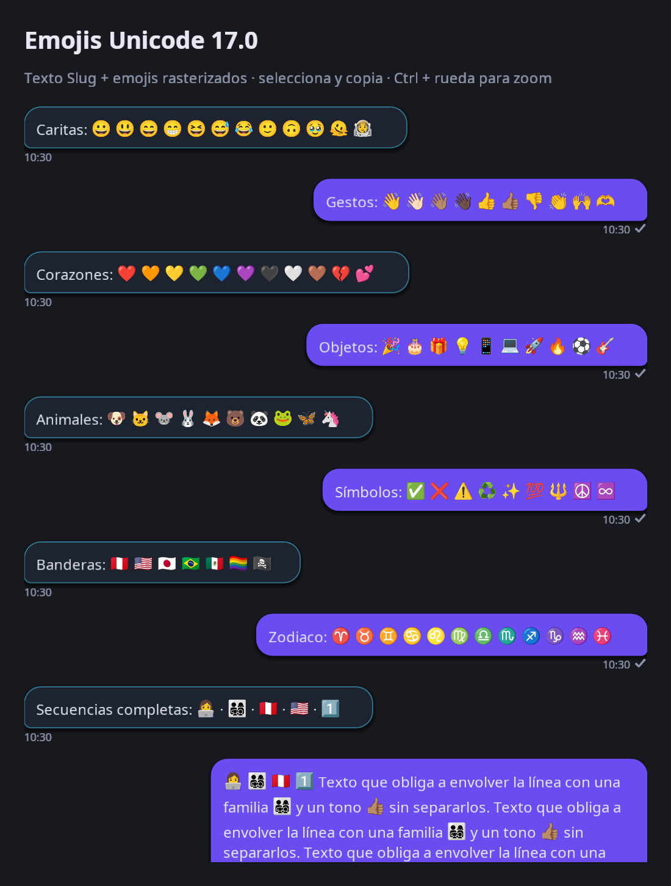

# Emoji inline — primera implementación

Primera entrega autorizada el 2026-10-08, derivada de [emoji.md](emoji.md).
El texto sigue usando el fork Godot 3/Slug. La ampliación autorizada tras revisar
el MVP usa un atlas Noto con el repertorio versionado **Emoji 17.0**: 3.944
secuencias fully-qualified y 9 componentes, más 1.272 variantes oficiales
minimally-qualified/unqualified. Es presentación de cuerpos de chat; no incluye
un picker ni stickers.

## Contratos de esta entrega

- La sustitución es sólo visual. Mensajes XMPP, registros e historial conservan
  el cuerpo Unicode. Nombres de atlas, codepoints hex y tags son detalles efímeros
  de presentación y nunca se transmiten en el `<body>`.
- Cada secuencia cubierta es un elemento inline indivisible para wrapping,
  reveal y selección. La extensión nativa devuelve su Unicode completo tanto en
  `get_text()` como en `get_selected_text()`; copiar usa esa misma representación.
- Se conserva Markdown. Emoji de etiquetas de enlaces se dibujan; destinos de
  enlaces y código inline/fences conservan texto. Tags escritos en el cuerpo
  se escapan: no pueden solicitar texturas mediante BBCode.
- No se sustituyen prefijos de una secuencia desconocida que añade selector,
  modificador, tags o ZWJ a una base cubierta. VS15 conserva presentación textual.
- Fuera del catálogo versionado se conserva el fallback tipográfico previo, que puede
  mostrar componentes o glifos ausentes. **Ese fallback todavía no garantiza
  atomicidad de grafemas** en el layout del motor. El reconocedor usa propiedades
  Unicode 17 para evitar sustituir prefijos, pero no implementa todo UAX #29
  (por ejemplo, GB9c para conjuncts índicos).
- Sin la API nativa `add_inline_image` se conserva el render Unicode previo:
  no introducir imágenes que hagan perder información al copiar.
- Zoom/correcciones regeneran la presentación sin modificar el cuerpo. Emoji
  estático no agrega procesos por frame ni redibujos continuos.

El atlas es un derivado raster de Noto Color Emoji 2.051; la licencia OFL y el
checksum de la fuente están incluidos. Unicode License V3 se distribuye aparte
para los datos. El generador verifica que cada secuencia canónica forme un único
glifo con bitmap disponible; las 3.953 pasan, sin cobertura faltante. Las
variantes listadas comparten imagen, conservando su propia secuencia al copiar.
No se inventan aliases quitando selectores arbitrariamente. Regeneración y atribución:
[app/emoji/README.md](../app/emoji/README.md).

## Motor y builds

La extensión acotada de `RichTextLabel` vive en
[tools/patches/z_emoji_inline_source.patch](../tools/patches/z_emoji_inline_source.patch).
Los builds desktop y Android la aplican/verifican antes de compilar. Si el
checkout no coincide, el build falla sin resetear archivos ni descartar edits
locales. La aplicación es idempotente. El parche puede trasladarse al overlay
del fork al integrarlo allí; mantener una sola fuente canónica del cambio.

Esta sesión compiló sobre copias aisladas del motor y overlay, conservando los
checkouts originales, y actualizó `bin/godot-xat`. El binario reporta
`3.6.4.rc.custom_build.aaf46b877`; el hash base no identifica por sí solo el parche
local aplicado. No hubo commits ni deploy.

El catálogo y su índice se comparten entre proveedores. Las **16 páginas** de
atlas se cargan sólo cuando se necesitan: 15 de 1024×1024 y una de 1024×512,
RGBA8 sin mipmaps en la carga cruda, celdas de 64 px con padding de 4 px. Son
**15.858.026 bytes de PNG** (15,1 MiB) y **62 MiB** de píxeles si se cargan todas.
Las páginas cargadas permanecen en caché durante la sesión; no hay LRU. Los
tamaños no incluyen estructuras del motor ni driver. Los `AtlasTexture` comparten
regiones y recursos; no se requieren archivos `.tres` temporales.
En exports se admite la textura importada/remapeada, y JSON/licencias se incluyen
explícitamente en los presets. El runtime también carga assets crudos desde PCK.

## Validación y revisión

Pruebas focalizadas sobre el binario real del fork: tokenización sin pérdida,
renderer nativo, selección Unicode, Markdown, imágenes ordinarias, wrapping,
reveal por píxeles, correcciones, zoom y carga de assets desde un PCK. También se
ejecutan las regresiones de mensajes, Markdown y UI; no se requiere la suite completa.
La prueba de catálogo comprueba exhaustivamente las 5.225 formas sin cargar
texturas. Las pruebas de integración usan una muestra acotada que cubre páginas,
aliases, selección, reveal y wrapping. El parche también pasó aplicación desde
el baseline y segunda aplicación idempotente durante la entrega inicial.
La ampliación pasó **188 checks, 0 FAIL y 0 errores de script** en las ocho
pruebas indicadas abajo, más los seis tests Python del generador. La prueba PCK
carga una secuencia representativa de cada una de sus 16 páginas.

```sh
SDL_AUDIODRIVER=dummy tools/run_tests.sh \
  tests/emoji_sequences_test.gd tests/emoji_catalog_test.gd tests/emoji_inline_test.gd \
  tests/emoji_layout_test.gd tests/emoji_pack_test.gd \
  tests/message_test.gd tests/markdown_test.gd tests/ui_test.gd

bin/godot-xat --path app res://dev/emoji_lab.tscn
```

`SDL_AUDIODRIVER=dummy` evita iniciar PulseAudio al correr headless/offscreen.
La captura se obtuvo con GLES3/llvmpipe en Linux: verifica el pipeline real del
fork mediante render por software, no rendimiento de una GPU física.
Una ejecución guardó el PNG correctamente y luego abortó al salir; el fork tiene
un fallo de shutdown conocido, por lo que también se revisan los checks y la imagen.
Draw calls y costes de raster/layout sobre hardware físico quedan por perfilar;
los tamaños de atlas anteriores no constituyen un benchmark de rendimiento.
La exportación mediante el editor no se validó en esta sesión porque no pudo
iniciar X11/Xvfb; la prueba PCK cubre el payload crudo, no APK/IPA ni sus templates.
Tampoco se enviaron mensajes a contactos reales ni se probó MAM en producción.



Pendiente de aprobación visual del usuario: alineación y tamaño a su zoom habitual.
Reiniciar xat carga el nuevo catálogo; los mensajes existentes no necesitan
migración. Fallback atómico para secuencias futuras o no reconocidas queda pendiente.
